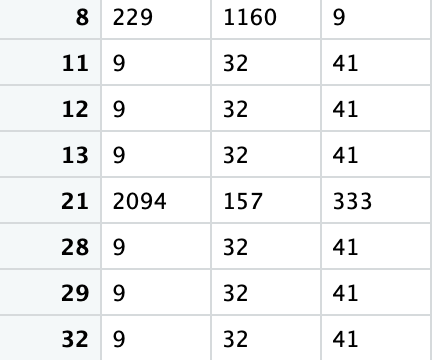

# Recommendation-Systems-LastFM
This study aims was to use "LastFM" dataset, a well-known music streaming service, in order to provide recommendations of artists to the users, applying different techniques. Pre-processing step consisted on the construction of 2 main basetables in order to apply recommendation systems (collaborative filtering, content based and hybrid). In addition, several functions were created in order to predict recommendations for users and to evaluate the results. 

## Pre-Processing Step

**CB Basetable**

Firstly we install needed packages to continue other steps properly.after importing and checking data, we started by creating the base table to be used for content based recommendation system.Having said that, we merged the `user_taggedartists` with `tags` then we used the "dcast" function to spread data-frame having as a result `artistID` as row and `tagValue`as columns.Finally we used `"ifelse" function to convert the values to binary values.

**CF Basetable**

In addition, we created a basetable to apply collaborative filtering RS.So we started by checking the "Histogram" of `user_artists` table to see how to categorize data properly.

In this way we categorized the weight variable into four categories: 
- category 1- less than 100
- category 2 - between 100 to 250
- category 3 - between 250 and 600
- category 4 - more than 600

By doing this we almost ended up with the similar number of observations in each category.Finally we applied "spread" function to have `artistID` as column, `userID` as row and also categories as values.

**Subseting tables and matching artistID**

in this step we started by taking a 5 percent sample of the CB basetable`to run the function in the next stpes faster.Then we matched the artistID from both CB AND CF basetables.In short, we transformed the Cf basetable as matrix to apply collaborative filtering functions.Also we reduced the amount of variables of CB base table to run the function more effectively and faster.

## Functions

we adapted the functions covered during the course to build our own functions based on different methods. In this sense, we based the construction on the mathematical formulas related with each methodology. 

**User based CF**

we calculated the similarity using the pearson correlation methodology.The function has train_data, test_data, NN (nearest neighbours considered for the calculation) and N(top N number of recommendations) as inputs, and displays the prediction values and top artists recommended for each user.

**Item based CF**

similar to user based we calculated the similarity using the pearson correlation methodology. The inputs and outputs have the same structure as the user based function.

**cluster based CF**

we used the kmeans function to identify the clusters then we calculated the mean of each cluster to use the result as a prediction. The function has data, N, centers and iter as inputs, and displays the prediction values and top artists recommended for each user.

**content based**

we calculated the similarity using the pearson correlation methodology.The function has CB basetable, CF basetable, NN (nearest neighbours considered for the calculation) and N(top N number of recommendations) as inputs, and displays the prediction values and top artists recommended for each user.

**MAE**

we calculated the mean of absolut error between the real values and the predicted one. The inputs are just the predtions and the real values, and it gives the result of the mean absolute error.

**F1**

Firstly we used confusion matrix and calculated `recall` by using true positive and false negative.then we calculated the preciasion that is result of true positive devided by true positive plus false positive.After that, we used the result of recall and percision to calculate F1 which shows the accuracy of the recommendation system. The inputs for the function are the predicted and real values.

**RMSE**

we calculated the root mean squared error between the real values and the predicted one. The inputs are just the predtions and the real values, and it gives the result of the root mean squared error.

## Recommendation Systems Computation

We started by spliting the data into train and test, taking a ratio of 7:3 respectively. After that, we run the different functions related to each recommendation system.

**CF RecSys**

We first run the UserBasedCF function and after that store the predictions and topN recommendations as data frames. After, we did the same but applying the ItemBasedCF function. 

We could first appreciate that the predicted results differ betwen the methods, and also the topN recommender artists. However, for some users we could see for instance one artist rated on the top3 using both methods. Another point to remark is that the Item Based function was much faster than the User Based, as in the sample we took for running the functions, we consider less artists than users. So in this scenario where we would have more users than artists, Item Based thechnique would be more efficient compared to User Based, so we would reccommend the first one if we care about efficiency.

*Top 3 artists for users using User Based method*

*Top 3 artists for users using Item Based method*

**CB RecSys**

We applied the content based function created before in order to test this recommendation system. We used the CB basetable where we have for the different artists the different tags that they have (1 if they have it and 0 otherwise in the datraframe). We also used our CF function in order to apply this technique for each user. 

The final results were also different from the methodologies described before. Clearly one problem we experience in this project was that we had many tags so we decided to subset them in order to make the function run much faster. Even with this modification, and just considering 100 out of more than 10 thouthand tags, the processing time was the longest in this case. This would suggest that the system efficiency is low compare to the other ones, and would be recommended to avoid it if one of the main concerns from the company is to implement and efficient system.

\newpage

*Top 3 artists for users using Content Based method*

## Evaluation

We used different metrics in order to compare and evaluate the different methods, including prediction metrics and clasification metrics.

**Prediction Accuracy**

*Content-based*
RSME = 0.1881902,
MAE = 0.03541553

*User-based*
RSME = 0.03789587,
MAE = 0.001436097

*Item-based*
RSME = 0.1668276,
MAE = 0.02783145

As we can see, the results are close to 0 with all the methodologies, which means that the predictions are quite accurate. However, is important to mention that other methods like cross validation are highly suggested in order to assess that the results are consistent. Even though the mentioned methodology is out of the scope of this project, we highly recommend to use it for future implementations.

Comparing the models, the lowest results in terms of RSME and MAE where from the User_based system, which means that this system is the more accurate among the 3 in terms of prediction.

**Classification Accuracy**

*User-based*
Recall = 0.7355769,
Precision = 0.9386503,
F1 = 0.8247978

*Item-based*
Recall = 0.001270648,
Precision = 0.5,
F1 = 0.002534854,

In terms of classification accuracy, we can clearly see that the user-based model is the one performing better, with a very high F1 result. Again, is important to remember that this result could be different and probably lower if cross validation techniques are applied in order to compare train wih test data.

## Hybrid Systems

**Compute Mean**

In this model, we used the predicted results from Content Based and Item Based models, in order to compute the mean of both results. We applied the function and then used the evaluation metrics such as RMSE, MAE and F1.

Altough we faced some problems during the implementation phase, we strongly believe that this system could be useful in order to evaluate different options and make the recommendation system more robust.

**Linear Regression**

In this model, we basecally try to apply the linear regression model in order to combine the COntent Based and Item Based systems. After applying the model, we got the following results.

We can appreciate that the content based is statistically significant in order to explain the target variable (p-value les than 5%), but the user based is not at all.

Even though we faced some problems during the implementation phase, we think that this system could be a good alternative to the traditional models like collaborative filtering or content based.

## Conclusion

After applying different recommendation systems to the Last.fm dataset, evaluating and comparing them, we can say that there are many ways to recommend artists to users based on different techniques and methodologies. On one hand, we think the item based system is faster and more efficient than the others as in our sample dataset we have less artists than users. However, userbased is more accurate in terms of prediction and classification metrics such as recall and precision. 

Regarding the other systems (content based and hybrid), we can say that it would be useful to implement them in a way that the recommendations can take into account the artist tags and also the similarity between different users. In this way, the hybrid systems could be a good solution to problems such as overspecialization, giving more novelty and accurate predictions to users.

Finally, for the future we can explore more hybrid systems and also other evaluation metrics in order to compare better the different models and lastly be able to improve users experience. 
